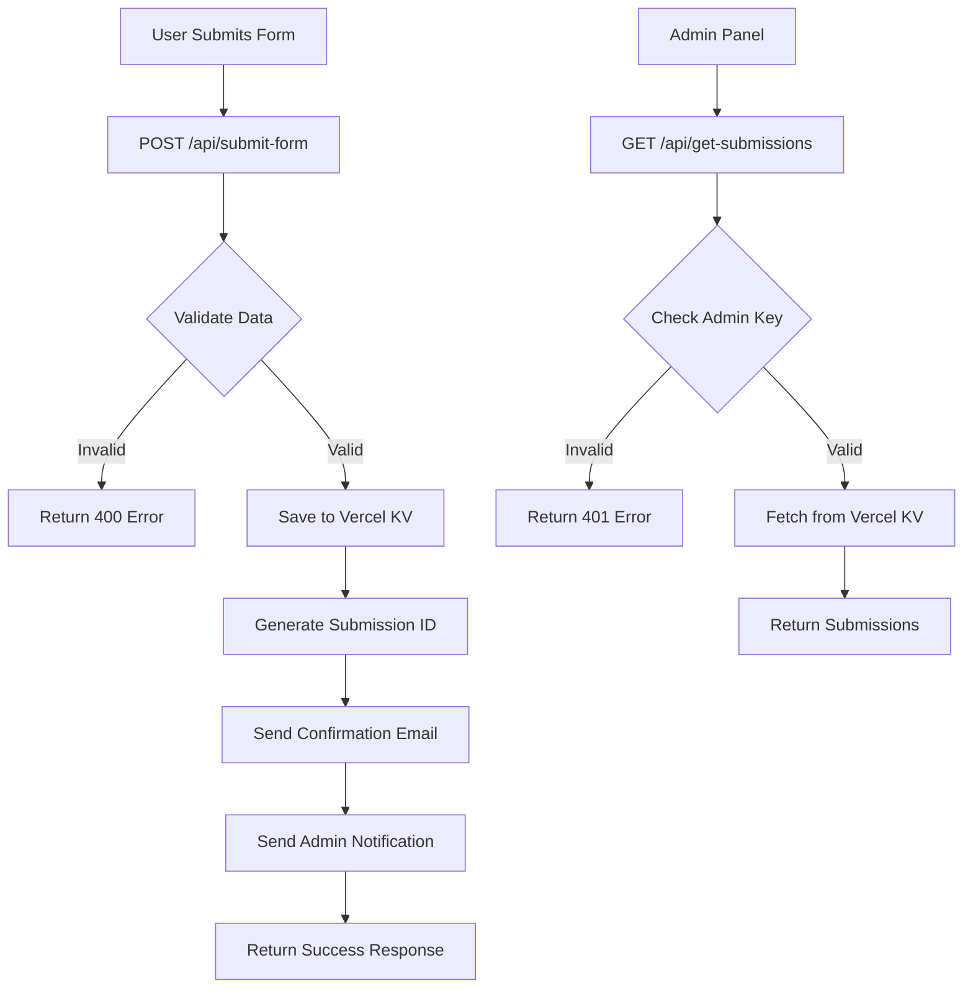

# HausPet Landing Page - API Documentation

> Complete API reference for HausPet serverless functions deployed on Vercel

---

## 📑 Table of Contents

- [[#Overview]]
- [[#API Endpoints]]
  - [[#Submit Form]]
  - [[#Get Submissions]]
  - [[#Get Resend Emails]]
  - [[#Send Bulk Email]]
  - [[#Recover Submissions]]
  - [[#Recover from Emails]]
- [[#Database Functions]]
- [[#Storage Functions]]
- [[#Environment Variables]]
- [[#Error Handling]]

---

## Overview

The HausPet Landing Page uses **Vercel Serverless Functions** for backend functionality. All API endpoints are located in the `/api` directory and are automatically deployed as serverless functions.

**Base URL (Production):** `https://your-domain.vercel.app/api`  
**Base URL (Development):** `http://localhost:5173/api`

**Tech Stack:**
- Runtime: Node.js
- Database: Vercel KV (Redis)
- Email: Resend API
- Authentication: Custom admin key

---

## API Endpoints

### Submit Form

**File:** `api/submit-form.mjs`  
**Endpoint:** `POST /api/submit-form`  
**Description:** Handles early access and pre-order form submissions

#### Request Body

```json
{
  "name": "John Doe",
  "email": "john@example.com",
  "phone": "+1 (555) 123-4567",
  "petType": "dog",
  "petName": "Max",
  "collarSize": "medium",
  "address": "123 Main St, City, Country",
  "message": "Optional message",
  "language": "EN",
  "type": "early-access" // or "pre-order"
}
```

#### Response

**Success (200):**
```json
{
  "success": true,
  "message": "Form submitted successfully",
  "submissionId": "sub_1234567890"
}
```

**Error (400):**
```json
{
  "success": false,
  "error": "missing_phone",
  "message": "Phone number is required for early access applications."
}
```

**Error (500):**
```json
{
  "success": false,
  "error": "submission_failed",
  "message": "Failed to save submission"
}
```

#### Features
- ✅ Saves to Vercel KV database
- ✅ Sends confirmation email to user (via Resend)
- ✅ Sends notification email to admin
- ✅ Validates required fields
- ✅ Generates unique submission ID
- ✅ Logs for recovery purposes

#### Email Templates

**Early Access Confirmation:**
- Subject: "Welcome to HausPet Early Access!"
- Includes: Name, benefits, next steps

**Pre-order Confirmation:**
- Subject: "HausPet Pre-order Confirmed!"
- Includes: Order number, product details, shipping info

**Admin Notification:**
- Subject: "New HausPet [Type] Submission"
- Includes: All submission details

---

### Get Submissions

**File:** `api/get-submissions.mjs`  
**Endpoint:** `GET /api/get-submissions`  
**Description:** Retrieves all form submissions (admin only)

#### Headers

```
x-admin-key: your_admin_access_key
```

#### Response

**Success (200):**
```json
{
  "success": true,
  "data": {
    "submissions": [
      {
        "id": "sub_1234567890",
        "name": "John Doe",
        "email": "john@example.com",
        "phone": "+1 (555) 123-4567",
        "petType": "dog",
        "petName": "Max",
        "collarSize": "medium",
        "message": "Message text",
        "date": "2024-01-15T10:30:00.000Z",
        "type": "early-access",
        "language": "EN"
      }
    ],
    "total": 1
  }
}
```

**Error (401):**
```json
{
  "success": false,
  "message": "Unauthorized - Invalid admin key"
}
```

#### Authentication
- Requires `x-admin-key` header
- Key must match `ADMIN_ACCESS_KEY` environment variable

---

### Get Resend Emails

**File:** `api/get-resend-emails.mjs`  
**Endpoint:** `GET /api/get-resend-emails`  
**Description:** Fetches sent emails from Resend API (admin only)

#### Headers

```
x-admin-key: your_admin_access_key
```

#### Response

**Success (200):**
```json
{
  "success": true,
  "emails": [
    {
      "id": "email_id",
      "to": ["user@example.com"],
      "subject": "Welcome to HausPet Early Access!",
      "created_at": "2024-01-15T10:30:00Z"
    }
  ]
}
```

#### Features
- ✅ Fetches emails from Resend API
- ✅ Returns email metadata
- ✅ Useful for email recovery

---

### Send Bulk Email

**File:** `api/send-bulk-email.mjs`  
**Endpoint:** `POST /api/send-bulk-email`  
**Description:** Sends bulk emails to selected users (admin only)

#### Headers

```
x-admin-key: your_admin_access_key
```

#### Request Body

```json
{
  "selectedUsers": [
    {
      "email": "user@example.com",
      "name": "John Doe"
    }
  ],
  "subject": "Important Update",
  "message": "Email message content"
}
```

#### Response

**Success (200):**
```json
{
  "success": true,
  "message": "Bulk email sent successfully",
  "results": {
    "successCount": 5,
    "failureCount": 0,
    "total": 5
  }
}
```

#### Features
- ✅ Sends personalized emails
- ✅ Returns success/failure counts
- ✅ Uses Resend API
- ✅ Rate limiting friendly

---

### Recover Submissions

**File:** `api/recover-submissions.mjs`  
**Endpoint:** `POST /api/recover-submissions`  
**Description:** Recovers submissions from Vercel function logs (admin only)

#### Headers

```
x-admin-key: your_admin_access_key
```

#### Request Body

```json
{
  "logData": "Paste Vercel function logs here..."
}
```

#### Response

**Success (200):**
```json
{
  "success": true,
  "message": "Successfully recovered submissions",
  "data": {
    "recoveredSubmissions": [...],
    "newSubmissions": [...],
    "duplicateCount": 0
  }
}
```

#### How to Use

1. Go to Vercel Dashboard
2. Navigate to your project → **Functions** tab
3. Find `submit-form` function logs
4. Copy logs containing `🔍 SUBMISSION_LOG_START` and `🔍 SUBMISSION_LOG_END`
5. Paste into recovery endpoint

---

### Recover from Emails

**File:** `api/recover-from-emails.mjs`  
**Endpoint:** `POST /api/recover-from-emails`  
**Description:** Recovers submissions from email content (admin only)

#### Headers

```
x-admin-key: your_admin_access_key
```

#### Request Body

```json
{
  "emailData": "Paste email content here..."
}
```

#### Response

**Success (200):**
```json
{
  "success": true,
  "message": "Successfully recovered submissions from emails",
  "data": {
    "recoveredSubmissions": [...],
    "newSubmissions": [...],
    "duplicateCount": 0
  }
}
```

#### How to Use

1. Open admin notification emails
2. Copy the entire email content
3. Paste into recovery endpoint
4. System extracts form data automatically

---

## Database Functions

### Permanent Storage

**File:** `api/permanent-storage.mjs`

#### `saveSubmission(submission)`

Saves a submission to Vercel KV database.

```javascript
const submissionId = await saveSubmission({
  name: 'John Doe',
  email: 'john@example.com',
  // ... other fields
})
```

**Returns:** `submissionId` (string)

#### `getAllSubmissions()`

Retrieves all submissions from Vercel KV.

```javascript
const submissions = await getAllSubmissions()
```

**Returns:** Array of submission objects

#### Features
- ✅ Primary storage: Vercel KV (Redis)
- ✅ Fallback storage: Global variable
- ✅ Automatic deduplication by email
- ✅ Persistent across deployments

---

### Database Module

**File:** `api/database.mjs`

Legacy database functions (kept for compatibility).

#### `saveToDatabase(submission)`

Saves to in-memory storage with external logging.

#### `getFromDatabase()`

Retrieves from in-memory storage.

---

### Storage Module

**File:** `api/storage.mjs`

Session-based storage functions.

#### `saveToStorage(submission)`

Saves to session storage.

#### `getFromStorage()`

Retrieves from session storage.

---

## Environment Variables

### Required Variables

```bash
# Email Service (Resend)
RESEND_API_KEY=re_YourResendAPIKey

# Database (Vercel KV)
KV_REST_API_URL=https://your-kv-instance.upstash.io
KV_REST_API_TOKEN=your_vercel_kv_token

# Admin Access
ADMIN_ACCESS_KEY=your_secure_admin_password
```

### Setting Environment Variables

**In Vercel:**
1. Go to Project Settings
2. Navigate to **Environment Variables**
3. Add each variable with its value
4. Redeploy the project

**In Development (.env):**
```bash
# Create .env file (never commit!)
RESEND_API_KEY=re_YourKey
KV_REST_API_URL=https://your-kv.upstash.io
KV_REST_API_TOKEN=your_token
ADMIN_ACCESS_KEY=your_password
```

---

## Error Handling

### Common Errors

#### Missing Environment Variables

```javascript
if (!process.env.RESEND_API_KEY) {
  console.log('❌ RESEND_API_KEY not found - email service not configured')
  // Continues without email (degrades gracefully)
}
```

#### Authentication Errors

```javascript
if (adminKey !== process.env.ADMIN_ACCESS_KEY) {
  return new Response(
    JSON.stringify({ success: false, message: 'Unauthorized' }),
    { status: 401 }
  )
}
```

#### Validation Errors

```javascript
if (!email || !name) {
  return new Response(
    JSON.stringify({
      success: false,
      error: 'missing_fields',
      message: 'Name and email are required'
    }),
    { status: 400 }
  )
}
```

### Error Response Format

All errors follow this structure:

```json
{
  "success": false,
  "error": "error_code",
  "message": "Human-readable error message"
}
```

---

## Data Flow



---

## Rate Limiting

### Vercel Limits

- **Function Execution:** 10 seconds (Hobby), 60 seconds (Pro)
- **Function Size:** 50MB
- **Bandwidth:** Varies by plan
- **Serverless Function Invocations:** 100,000/month (Hobby)

### Resend Limits

- **Free Plan:** 100 emails/day, 3,000 emails/month
- **Rate Limit:** 10 requests/second

---

## Security Best Practices

### ✅ Implemented

- Admin endpoints require authentication
- Environment variables for sensitive data
- Input validation on all endpoints
- No secrets in code
- HTTPS only in production

### 🔒 Recommendations

- Rotate admin key regularly
- Monitor Vercel function logs
- Enable Vercel security features
- Use rate limiting for production
- Implement CAPTCHA for public forms

---

## Testing

### Manual Testing

```bash
# Test form submission
curl -X POST https://your-domain.vercel.app/api/submit-form \
  -H "Content-Type: application/json" \
  -d '{
    "name": "Test User",
    "email": "test@example.com",
    "phone": "+1234567890",
    "petType": "dog",
    "type": "early-access",
    "language": "EN"
  }'

# Test get submissions (replace ADMIN_KEY)
curl https://your-domain.vercel.app/api/get-submissions \
  -H "x-admin-key: YOUR_ADMIN_KEY"
```

### Development Testing

```bash
# Start dev server
npm run dev

# Test locally
curl -X POST http://localhost:5173/api/submit-form \
  -H "Content-Type: application/json" \
  -d '{ ... }'
```

---

## Monitoring

### Vercel Dashboard

Monitor in real-time:
- Function invocations
- Error rates
- Response times
- Bandwidth usage

### Logs

Access logs in Vercel:
1. Go to your project
2. Click **Functions** tab
3. Select a function
4. View real-time logs

---

## API Version

**Current Version:** 1.0.0  
**Last Updated:** October 1, 2025  
**Compatibility:** Vercel, Node.js ≥16

---

## Support

**Issues:** https://github.com/prydatkoo/HausPet-landing/issues  
**Email:** hello@hauspet.net  
**Documentation:** See README.md

---

## Tags

`#api` `#serverless` `#vercel` `#backend` `#documentation` `#hauspet` `#nodejs`

